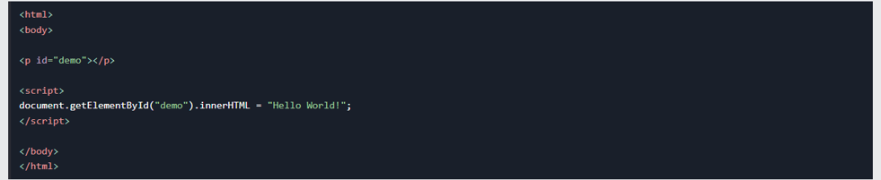
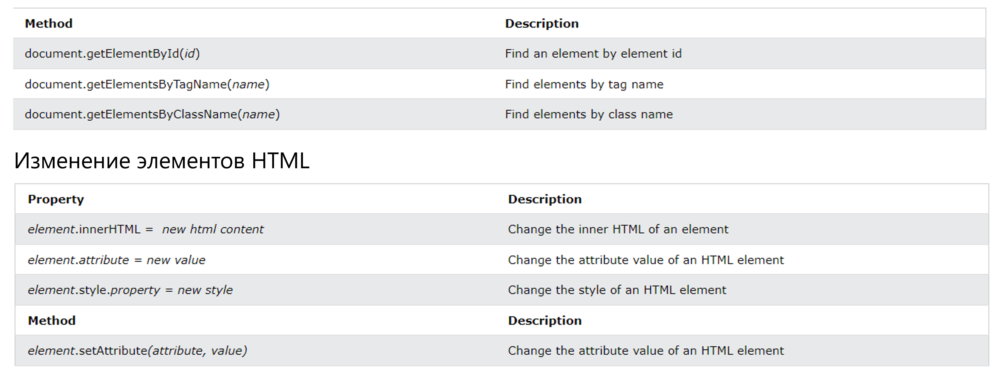
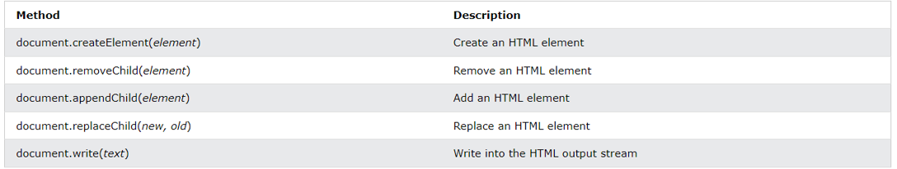

# HTML DOM (объектная модель документа)
### Когда веб-страница загружается, браузер создает объектную модель документа страницы .
### Модель HTML DOM построена как дерево объектов :

## Благодаря объектной модели JavaScript получает все возможности, необходимые для создания динамического HTML:

### - JavaScript может изменять все элементы HTML на странице.
### - JavaScript может изменить все атрибуты HTML на странице.
### - JavaScript может изменить все стили CSS на странице.
### - JavaScript может удалять существующие элементы и атрибуты HTML
### - JavaScript может добавлять новые элементы и атрибуты HTML
### - JavaScript может реагировать на все существующие HTML-события на странице.
### - JavaScript может создавать новые HTML-события на странице
#
# Что такое ДОМ?

### DOM является стандартом W3C (World Wide Web Consortium).
### DOM определяет стандарт доступа к документам:
### «Объектная модель документа W3C (DOM) — это независимый от платформы и языка интерфейс, который позволяет программам и сценариям динамически получать доступ и обновлять содержимое, структуру и стиль документа».
### Стандарт W3C DOM разделен на 3 разные части:
### - Core DOM — стандартная модель для всех типов документов
### - XML DOM — стандартная модель для XML-документов
### - HTML DOM — стандартная модель для HTML-документов

#
# Что такое HTML DOM?
### HTML DOM — это стандартная объектная модель и программный интерфейс для HTML. Он определяет:
### - Элементы HTML как объекты
### - Свойства всех элементов HTML
### - Методы доступа ко всем элементам HTML
### - События для всех элементов HTML
### Другими словами: HTML DOM — это стандарт получения, изменения, добавления или удаления элементов HTML.
#
# JavaScript — методы HTML DOM
## Методы HTML DOM — это действия, которые вы можете выполнять (с элементами HTML).
## Свойства HTML DOM — это значения (элементов HTML), которые вы можете установить или изменить.

## Интерфейс программирования DOM
### Доступ к HTML DOM можно получить с помощью JavaScript (и других языков программирования).
### В DOM все элементы HTML определяются как объекты .
### Программный интерфейс — это свойства и методы каждого объекта.
### Свойство — это значение, которое вы можете получить или установить (например , изменить содержимое элемента HTML).
###   Метод — это действие, которое вы можете выполнить (например , добавить или удалить элемент HTML).
## Пример
### В следующем примере содержимое ( ) innerHTMLэлемента изменяется 
с помощью id="demo":

### В приведенном выше примере getElementByIdэто метод , аinnerHTML свойство . 
#
# Объект документа HTML DOM
### Объект документа представляет вашу веб-страницу.
### Если вы хотите получить доступ к любому элементу на HTML-странице, вы всегда начинаете с доступа к объекту документа.
### Ниже приведены несколько примеров того, как вы можете использовать объект документа для доступа и управления HTML.

# 
# Добавление и удаление элементов

